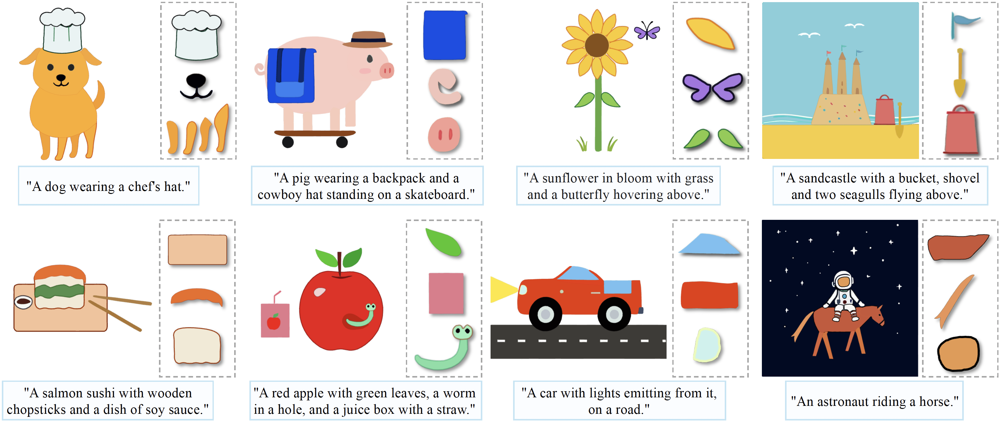
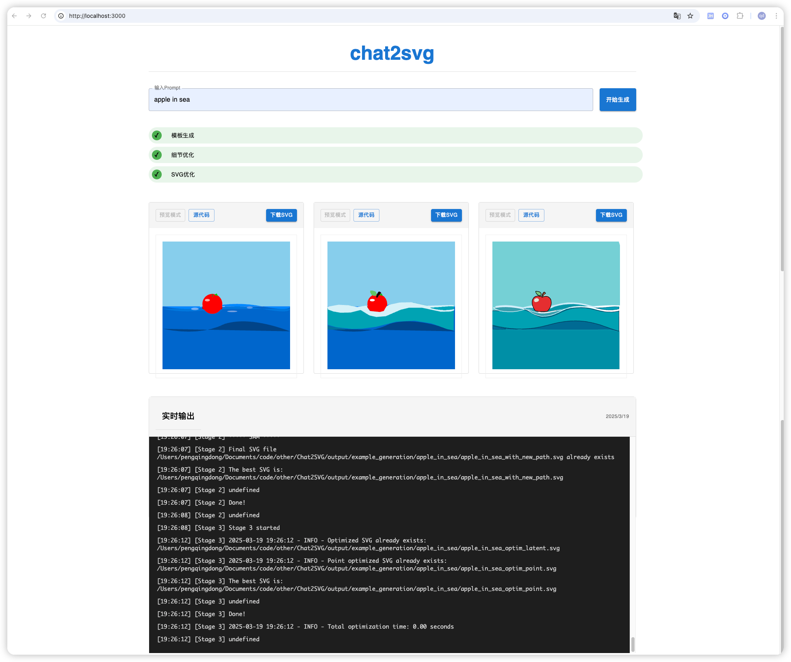

# Chat2SVG: Vector Graphics Generation with Large Language Models and Image Diffusion Models

[](https://arxiv.org/abs/2411.16602)
[](https://chat2svg.github.io/)



## Overview

Chat2SVG is a framework for generating vector graphics using large language models and image diffusion models. The system works in multiple stages to generate, enhance, and optimize SVG from text descriptions.


## Updates
- **[2025.04.02]**: The official Anthropic APIs are now supported. You can configure this in the `.env` file. You can also adjust the `max_tokens` parameter in `utils/gpt.py` on line 127. Thanks to [@potpov](https://github.com/potpov)'s contribution.
- **[2025.03.31]**: We sincerely thank [@pq-dong](https://github.com/pq-dong) for implementing a web demo for convenient use. Visit the [repository](https://github.com/pq-dong/Chat2SVG) for more details. The web demo will be refined and updated in the future.

- [x] SVG template generation with Large Language Models
- [x] Detail enhancement with image diffusion models
- [x] SVG shape optimization


## Setup
Clone the repository:
```shell
git clone git@github.com:kingnobro/Chat2SVG.git
cd Chat2SVG
conda create --name chat2svg python=3.10
conda activate chat2svg
```

Install PyTorch and other dependencies:
```shell
conda install pytorch==2.5.1 torchvision==0.20.1 torchaudio==2.5.1  pytorch-cuda=11.8 -c pytorch -c nvidia
pip install git+https://github.com/facebookresearch/segment-anything.git
pip install -r requirements.txt
```

Install [diffvg](https://github.com/BachiLi/diffvg) for differentiable rendering:
```shell
git clone https://github.com/BachiLi/diffvg.git
cd diffvg
git submodule update --init --recursive
conda install -y -c anaconda cmake
conda install -y -c conda-forge ffmpeg
pip install svgwrite svgpathtools cssutils torch-tools
python setup.py install
cd ..
```

Install [picosvg](https://github.com/googlefonts/picosvg) for SVG cleaning:
```shell
git clone git@github.com:googlefonts/picosvg.git
cd picosvg
pip install -e .
cd ..
```

## Pipeline 🖌

> [!TIP]
> We provide two ways to generate SVG templates:
> 1. If you want to **create high-quality SVG**, we recommend checking the output of each stage to ensure the generated SVG meet "human-preferred" criteria.
> 2. If you want to **compare the performance** of our method with your own SVG generation method, we also provide a simple way to automatically generate all outputs.

> [!CAUTION]
> Hong Kong is banned by Anthropic/OpenAI. Therefore, I use a third-party API from [WildCard](https://bewildcard.com/) to forward requests to Claude. If you are in a region where you can access Anthropic/OpenAI directly, you can modify lines 64-65 in `utils/gpt.py` to use the original Anthropic API. Additional modifications may be required. Sorry for the inconvenience.

## Step-By-Step Pipeline (For High-Quality SVG 🎨)

> We have provided some sample generation and intermediate results in the `output/example_generation` folder. You can check them to get a better understanding of the pipeline.

### Stage 1: Template Generation

First, paste your Anthropic API key into the `.env` file:
```shell
OPENAI_API_KEY=<your_key>
```

Then, run the following command to generate SVG templates:
```shell
cd 1_template_generation
bash run.sh
```
- The detailed prompts of each target object can be found in `utils/util.py → get_prompt()`.
- Output files will be saved in `output/example_generation/stage_1` folder.
- To visualize/edit the SVG results, we recommend using the [SVG](https://marketplace.visualstudio.com/items?itemName=jock.svg) and [SVG Editor](https://marketplace.visualstudio.com/items?itemName=henoc.svgeditor) plugins of VSCode.
- Since multiple SVG templates are generated, we use [ImageReward](https://github.com/THUDM/ImageReward) or [CLIP](https://github.com/openai/CLIP) to select the best one for the next stage. You can also manually select the best SVG template based on your own preference.
- Finally, there should be a `target_template.svg` (e.g., `apple_template.svg`) file in the root directory.

> [!TIP]
> Our visual rectification process can solve common issues in SVG. However, we've observed that in some cases, VLM may actually degrade the quality of the SVG during rectification. We recommend double-checking the output before and after rectification to ensure the best results.

### Stage 2: Detail Enhancement

```shell
cd 2_detail_enhancement
bash download_models.sh  # download pretrained model weights
bash run.sh              # detail enhancement
```

The above command will:
- clean SVG templates using picosvg (convert shapes to cubic Bézier curves), output `apple_clean.svg`
- generate target images using [SDXL](https://civitai.com/models/269232/aam-xl-anime-mix) and [ControlNet](https://huggingface.co/xinsir/controlnet-tile-sdxl-1.0), output `apple_target.png`
- use [Segment Anything Model (SAM)](https://github.com/facebookresearch/segment-anything) to add new shapes, output `apple_with_new_shape.svg`

> [!TIP]
> 1. Adjust the `strength` to control the strength of the SDEdit (Image to Image). We recommend `0.75` for mild enhancement and `1.0` for strong enhancement.
> 2. The default number of generated target images is `4`, and we select the **first one** as the default target image. You can check all generated images to select your preferred one.
> 3. Adjust `points_per_side` in SAM to control the granularity of the added shapes, and adjust `thresh_iou` to control the threshold that determines whether a shape is a new shape or not.
> 4. As mentioned in the paper's limitation section, SAM sometimes may not add appropriate shapes. Please check the output and modify if necessary.


### Stage 3: SVG Shape Optimization
```shell
cd 3_svg_optimization
bash download_models.sh  # download pretrained SVG VAE model
bash run.sh              # optimize SVG shapes (GPU consumption: less than 4GB)
```

> [!TIP]
> 1. We turn off `enable_path_iou_loss` by default, which can greatly improve time efficiency. To avoid path semantic meaning shifts, you can set it to `True`.
> 2. We proportionally scale up the loss weights (different from the paper) to ensure faster convergence.
> 3. Results: `apple_optim_latent.svg` and `apple_optim_point.svg`

## Automated Pipeline (For Comparison ⚖️)
Code coming soon. Alternatively, you can enter each folder and run the `run.sh` script to generate all outputs.